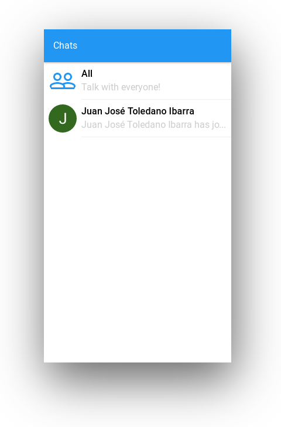
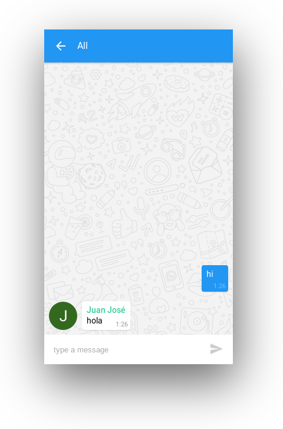

# REACT CHAT APP
## Setup the environment
### Prerequisites:
* node >= 4
* npm 3
* Chrome
* Chrome React extension
* SublimeText / Atom / VSCode or any other text editor with support for JSX syntax and eslint integration.

Some Sublime Text recommended plugins:
* babel (ES6 & JSX syntax)
* SublimeLinter
* SublimeLinter-contrib-eslint

### Start hacking:
To start, clone this repo:
```
$ git clone https://github.com/atabel/react-chat-app-workshop
```
Install the dependencies:
```
$ npm install
```

Start the development server:
```
$ npm start
```
Open your text editor and start hacking.

This project was bootstrapped with [Create React App](https://github.com/facebookincubator/create-react-app). For more info about the environment, take a look at [ABOUNT_CRA.md](./ABOUT_CRA.md)

## Training

### Exercise 1 (first components)

Create a basic component. It should receive only one prop (`name`) and render a greeting message inside a `<div>` ('hello Abel!'):
```html
<Geeting name="Abel" />
```
Create the new component in a new file inside `components/` folder (`greeting.js`).

Import your new component in `app.js` and render it inside the `App` component.

Ok, now you know how to create a basic component, let's create a more useful one.
We're going to create the main app screen. It should have a header and a list of conversations, so we can write 2 new components: `<ChatList />` and `<Header>`.



You can start with `Header`, which should be simpler. It should have the following api:
```js
<Header title={yourAppTitleHere} />
```
As you see, it's pretty similar to your first `Greatting` component, so you can rename it ;)

Now, lets go with the second component (ChatList). It should look like this:
```js
<ChatList conversations={arrayOfConversations} onSelectChat={handler} />
```
A conversation model has the following shape:
```js
{
    fullName: string,
    avatar: string,
    name: string,
    familyName: string,
    email: string,
    id: string
}
```
`onSelectChat` is a function which will be called when the user taps on a conversation. For the time being it can be something like
`(conversationId) => console.log('Conversation selected:', conversationId)`.

You can also mock the `arrayOfConversations` for now:

```js
<div>
    <Header title="Chats" />
    <ChatsList
        onSelectChat={(conversationId) => console.log('Conversation selected:', conversationId)}
        conversations={[
            {id: '1', fullName: 'Abel Toledano', avatar: 'http://example.com/avatar.jpg'},
            {id: '2', fullName: 'Pedro Ladaria', avatar: 'http://example.com/avatar2.jpg'},
        ]}
    />
</div>
```

### Exercise 2 (work with state)

Ok now we have a simple UI with a list of conversations, it's time to connect it with real data from the chat server.

Let's start reading the conversations list from the `App` component state:

```js
...

getInitialState() {
    return {
        conversations: []
    };
},

...

render() {
    const {conversations} = this.state;
    return (
        <div>
            <Header title="Chats" />
            <ChatsList
                onSelectChat={(conversationId) => console.log('Conversation selected:', conversationId)}
                conversations={conversations}
            />
        </div>
    )
},
```

Then subscribe to chat client events and change the app state adding new conversations when a new user is received from server.
```js
import chatClient from '../chat-client';

...

    componentDidMount() {
        chatClient.on('user', ({payload}) => {
            // use this.setState() to add a new conversation
        });
        chatClient.getUsers();
    },

...
```
Each time you call `setState()` method a new render will be triggered ([almost always](https://facebook.github.io/react/docs/react-component.html#shouldcomponentupdate)).

Simple, isn't it?

Ok, do you remember the `onSelectChat` in the `<ChatsList />` component? Our next step is implementing that behaviour: we want to open a conversation when the user tap on it.

Let's add a new attribute to our app state:
```js
getInitialState() {
    return {
        conversations: [],
        currentConversationId: null,
    };
},
```
And set it when the user taps a conversation:
```js

...

openConversation(conversationId) {
    // set the currentConversation
},

...

    <ChatsList
        onSelectChat={this.openConversation}
        conversations={conversations}
    />
    
...
```
Just to test it works fine, lets render the current conversationId:
```js
render() {
    const {conversations, currentConversationId} = this.state;
    return (
        <div>
            <Header title="Chats" />
            <div>Current conversation: {currentConversationId}</div>
            <ChatsList
                onSelectChat={(conversationId) => console.log('Conversation selected:', conversationId)}
                conversations={conversations}
            />
        </div>
    );
},

```
Ok, the next step is create a new app screen with the conversation. It should have the following api:
```js
<Conversation
    messages={listOfMessages}
    currentUser={currentUser}
    users={conversationUsers}
/>
```
A message model can have the following api:
```js
{
    text: string,
    time: number,
    sender: string, // id
    receiver: string, // id
}
```
This component should render a list of messages, you can align your own messages to the right and the other users messages to the left (like telegram or whatsapp do) for example.



Once you have created the `<Conversation />` component, you can render it when there is a `currentConversationId` selected:

```js
render() {
    const {currentUser} = this.props;
    const {conversations, currentConversationId} = this.state;
    const conversation = conversations[currentConversationId];
    if (conversation) {
        return (
            <div>
                <Header title={conversation.name} />
                <Conversation
                    messages={this.getConversationMessages(conversation.id)}
                    currentUser={currentUser}
                    users={this.getConversationUsers(conversation.id)}
                />
            </div>
        );
    } else {
        return (
            <div>
                <Header title="Chats" />
                <div>Current conversation: {currentConversationId}</div>
                <ChatsList
                    onSelectChat={(conversationId) => console.log('Conversation selected:', conversationId)}
                    conversations={conversations}
                />
            </div>
        );
        
    }
},
```
You can already implement the `getConversationUsers` method, but you can mock the result of the `getConversationMessages` for the moment:
```js
getConversationMessages(conversationId) {
    const me = this.props.currentUser.id;
    return [
        {text: 'hola', sender: me, receiver: conversationId, time: Date.now()},
        {text: 'hi', sender: conversationId, receiver: me, time: Date.now() - 60000},
    ],
},
```
We also need a way to close the current conversation, so we can add a back button to the `<Header />` component:
```js
...

closeConversation() {
    this.setState({currentConversationId: null});
},

...

    <div>
        <Header
            title={conversation.name}
            icon={require('../assets/ic_arrow_back.svg')}
            onTapIcon={this.closeConversation}
        />
        <Conversation
            messages={this.getConversationMessages(conversation.id)}
            currentUser={currentUser}
            users={this.getConversationUsers(conversation.id)}
        />
    </div>
```

### Exercise 3 (conversation)

At this point we have an application with two screens (`ChatsList` and `Conversation`), we can enter a conversation when we click on it and we can close the conversation to go back to `ChatsList` screen.

The next step is listening for messages coming from server and store them in our app state. To do so, we just need to subscribe to the `'message'` event as we already did for the `'user'` one. In the `<App />` component:

```js
addMessage(message) {
    // store the new message in the component state
},

componentDidMount() {
    ...
    chatClient.on('message', ({sender, payload, time, receiver}) => {
        this.addMessage({sender, text: payload.text, time, receiver});
    });
    ...
},
```

And we need a way to send messages to a conversation too. To do so, lets create a `<ChatBar />` component and render it inside the `<Conversation />` component:
```js
<ChatBar onSend={sendMessage} >
```
This component should render a text input and a button.

The `sendMessage` method should send the message to the chat server and store it in the app state:

```js
sendMessage(text) {
    const me = this.props.currentUser;
    const {currentConversationId} = this.state;
    this.addMessage({
        sender: me,
        receiver: currentConversationId,
        text,
        time: Date.now(),
    });
    chatClient.sendMessage(text, currentConversationId);
},
```
Now it's time to change the previous mocked implementation of `getConversationMessages`. Now we can read the messages from the app state. Take into account you should pass to `<Conversation />` only the messages of the current conversation, so you should filter the messages list (or store them in an object indexed by conversationId)

### Exercise 4 (style your app, please)

Remember that [flexbox](https://css-tricks.com/snippets/css/a-guide-to-flexbox/) is your friend ;)

### Exercise 5 (redux)

* Extract the state from the omnipotent `<App />` component.

* Identify the actions in your application (`'SEND_MESSAGE'`, `'RECEIVE_MESSAGE'`, `'RECEIVE_USER'`, `'OPEN_CONVERSATION'`, `'CLOSE_CONVERSATION'`, etc.).

* Create some reducers which represent the state shape of your application and which change it when receiving that actions.

* [Create an store](https://github.com/reactjs/redux/blob/master/docs/api/createStore.md) with your reducer and remember to [provide](https://github.com/reactjs/react-redux/blob/master/docs/api.md#provider-store) it to your components tree.

* [Connect](https://github.com/reactjs/react-redux/blob/master/docs/api.md#connectmapstatetoprops-mapdispatchtoprops-mergeprops-options) your components to the store. Remember you're not limited to connect only the `App` component, you can (and probably should) connect multiple components deep in the components tree. That will simplify your app and you won't need to pass some props down multiple levels.

* Create some action creators and dispatch them. Remember actions creators are the place where trigger side effects (like sending a message to the server), for this propose I recommend you to use the [redux-thunk](https://github.com/gaearon/redux-thunk) middleware.

* I also recommend you the [redux-logger](https://github.com/evgenyrodionov/redux-logger) middleware.

### Exercise 6 (add your own feature)
